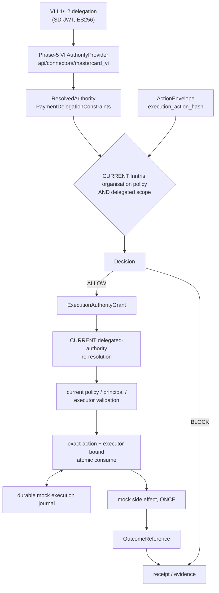

# Verifiable Intent as an authority input to Inntris policy

A deterministic, offline, reproducible demonstration built on the Phase-5
connector at [`api/connectors/mastercard_vi`](../../../api/connectors/mastercard_vi).

## What this PROVES

- A real, supported Verifiable Intent delegation is **verified as an
  authority input** — Layer 1 + Layer 2, against the pinned upstream
  reference implementation, with the issuer key taken from trusted
  configuration rather than from the artefact.
- A **VI-valid act may still be denied** by stricter current Inntris
  organisation policy, using the deployed reason codes.
- An **ALLOW creates bounded execution authority** tied to the exact
  action and the exact authenticated executor, within a window.
- **Consume, retry and replay behaviour is enforced**, and issuance-time
  verification alone is never sufficient: the delegation is re-resolved
  before every consumption.
- The proof's mock executor **prevents duplicate side effects** under
  every recovery state tested.

## What this DOES NOT prove

- **No Mastercard partnership.**
- **No Mastercard endorsement.**
- **No Mastercard certification.**
- **No production Mastercard conformance.**
- **No Agent Pay / AP4M integration.** Neither is contacted, implemented
  or simulated.
- **No payment settlement**, and **no downstream settlement
  cryptographic proof**. A receipt here proves authorisation and
  consumption evidence to the limits actually implemented. It is not
  proof that money moved, or that it did not.
- **No production issuer-key discovery.** There is no JWKS fetch, no
  `/.well-known` lookup and no key-rotation protocol. Trusted issuer keys
  come from explicit server-side configuration.
- **No production executor enforcement.** The mock executor and its
  SQLite execution journal are proof components; nothing in `api/`
  imports them and they settle nothing.
- **No support for unsupported VI constraints.** Anything outside the
  connector's mapped set makes the delegation unusable rather than being
  partially enforced.

The issuer string `https://issuer.mastercard.com` is the Verifiable
Intent reference profile's own issuer namespace. It asserts no
relationship with Mastercard.

## Architecture statement

Verifiable Intent answers *what did an issuer and a user delegate*.
Inntris answers *what does this organisation permit, right now, for this
principal, and who may execute it*. Different questions. The second is
not downstream of the first being satisfied — it is independent, and it
may refuse what the first plainly allows.

The effective permission is an intersection:

```
organisation policy  AND  delegated authority scope
```

A delegated scope can only narrow. It can never widen an organisation
limit, re-enable a blocked action, or authorise a destination the
organisation refuses.



Issuance-time Verifiable Intent verification is **not** enough to
consume. See [architecture.md](architecture.md) for what is trusted at
each stage.

## Verifiable Intent build under test

| | |
|---|---|
| Site | <https://verifiableintent.dev/> |
| Repository | <https://github.com/agent-intent/verifiable-intent> |
| Commit | `356c29635f1c44df7de02edb58699ca9f29bece6` |
| Package version | `0.1.0` |
| Specification | v0.1-draft, 2026-02-18 |
| Mode | Autonomous, Layer 1 + Layer 2 |

The pin lives in `api/connectors/mastercard_vi/profile.py` and is
**checked, not asserted**: the commit actually installed is read back
from the distribution's `direct_url.json`, written into every evidence
file as `vi_upstream.installed_commit`, and the proof refuses to run on a
mismatch. The connector's own loader refuses a different package version
rather than assuming compatibility.

**Layer 3 is never presented.** Inntris authorises an act *before* it
happens; Layer 3 is the agent's record of an act already committed to a
payment network and a merchant, so at evaluation time none exists. The
connector rejects any Layer 3 key outright, and the proof fixture never
builds one — both facts are asserted by tests.

## Running it

```bash
pip install -e '.[dev]'
pip install -e '.[mastercard-vi]'
alembic upgrade head
python -m scripts.mastercard_vi_proof
```

Requires `DATABASE_URL` pointing at a PostgreSQL migrated to head — the
proof runs against the real authority persistence, not a simulation. It
makes no network call, prints the case table, writes one JSON evidence
file per case to `evidence/`, and exits non-zero if any assertion fails.

**The evidence pack is generated output and is not committed.** Its
contents change on every run — ES256 carries a random nonce, so digests
and signatures differ — and committing it wrote hundreds of high-entropy
public values next to key-shaped JSON field names, which the
repository's secret-scanning gate correctly flags. Run the command above
to produce it, or download the `mastercard-vi-evidence` artifact from
any CI run on this branch.

The same cases run in CI as `tests/test_mastercard_vi_proof.py`, with
cases 8–22 in `tests/test_mastercard_vi_acceptance.py` and the reproduced
Core defects in `tests/test_authority_core_regressions.py`.

### What "deterministic" means here

The **outcomes** are deterministic: same cases, same decisions, same
reason codes, every run. Keys are derived from published labels and
SD-JWT salts are made reproducible for each build. The **signature bytes
are not**, and no byte-level determinism is claimed: ES256 carries a
random nonce, so the serialisation — and therefore the artefact digest —
differs between runs. Pinning that would mean patching the reference
implementation's cryptography, which is exactly what a proof of
cryptographic behaviour may not do. Each evidence file records the
digest of the run that produced it.

## Proof fixture

One cryptographically valid autonomous delegation, permitting:

- **Supplier A** and **Supplier B** as payees;
- **USD up to 20,000.00**, as `mandate.payment.amount_range` — a
  per-transaction bound, not a cumulative budget.

The Inntris organisation policy is deliberately narrower:

| Rule | Value |
|---|---|
| Action type | `wallet_transaction` |
| Chain | `eip155:8453` |
| Allowlisted execution recipient | Supplier A's account only |
| Per-action limit | 10,000.00 USD |
| Daily limit | 100,000.00 USD |

Supplier B is permitted by Verifiable Intent and *not* allowlisted by
Inntris. The Inntris per-action cap is below the mandate's ceiling. Those
two gaps are what cases 2 and 3 exercise.

`wallet_transaction` was chosen because it is the existing payment action
whose evaluation already runs **both** the recipient allowlist and the
spend caps. No policy behaviour was changed to make the cases come out.

## The seven cases

| # | case | VI | Inntris policy | grant | consume |
|---|---|---|---|---|---|
| 1 | permitted + executed | PASS | ALLOW | issued | authorised, side effect once |
| 2 | VI-valid, organisation recipient block | PASS | BLOCK `wallet_recipient_not_allowed` | none | — |
| 3 | VI-valid, organisation spend block | PASS | BLOCK `per_action_limit_exceeded` | none | — |
| 4 | exact-action binding | PASS | ALLOW | issued | `grant_action_mismatch`, then authorised |
| 5 | idempotent retry vs replay | PASS | ALLOW | issued | authorised, recovered, `execution_ref_conflict` |
| 6 | expiry | PASS | ALLOW | issued | `grant_expired` |
| 7 | executor binding | PASS | ALLOW | issued | `grant_executor_mismatch`, then authorised |

49 assertions across the seven cases. Every row comes from the
deterministic proof run; nothing here is estimated.

### Why cases 2 and 3 prove VI is an input, not Inntris's decision

Both refuse an action whose delegation is **entirely valid**. Each
evidence file records, in order:

1. `vi_verification.is_verified: true`, with the upstream checks the
   reference implementation performed — `l2_aud`, the L2 reference
   binding, the open-payment mandate's structure, the L1 card-id
   cross-check;
2. `resolved_authority.delegate_binding_status: bound`, and the mapped
   scope showing `payee:id:supplier-b` among `allowed_payees` and
   `max_amount: "20000.00"`;
3. `inntris_decision.decision: block` with the organisation's own reason
   code and its `policy_hash`.

In case 2 the payee is one the mandate explicitly permits. In case 3 the
amount is 18,000.00 against a ceiling of 20,000.00. Neither refusal can
be a broken credential, because the credential verified first and its
supported constraints were satisfied.

Order matters and is structural: the connector resolves and verifies the
delegation **before** any policy check runs. A refusal therefore always
carries a VI verdict established beforehand.

### Why cases 4–7 demonstrate execution authority, not a policy-only API

A policy API answers "may this class of thing happen". Each case presents
an action a policy API would have to approve, and each is refused anyway
— because the ALLOW produced authority bound to one exact act, one
executor, and one window, re-validated against a fresh delegation
resolution before it may be spent.

- **Case 4 — bound to the act.** The grant is for 8,500.00. The executor
  presents 9,500.00, under the 10,000.00 cap and inside the mandate's
  range, so policy would independently permit it. Refused
  `grant_action_mismatch`. The failed attempt does **not** burn the
  grant, and the original 8,500.00 then consumes.
- **Case 5 — one execution, recoverable.** The same `execution_ref`
  returns the original consumption evidence and does not invoke the
  executor again. A *different* `execution_ref` on the same spent
  authority is refused. Same reference is idempotent success; different
  reference is replay failure. Not the same event.
- **Case 6 — bound in time.** The exact action, by the exact bound
  executor, with a delegation that still re-resolves cleanly, is refused
  `grant_expired` once the window closes. Advanced with an injected
  clock; nothing sleeps.
- **Case 7 — bound to the executor.** Executor B — same organisation,
  same scopes, the same caller-supplied `executor_reference` — is refused
  `grant_executor_mismatch`. The binding derives from the authenticated
  API key. The refusal does not burn the grant, and Executor A still
  consumes it.

## Inntris verdict and reason vocabulary

The live deployed codes, identical in value to the existing
`api.policy.PolicyViolation` vocabulary. None was invented for this proof
— in particular it is **not** `recipient_not_allowed` or
`spend_limit_exceeded`.

Verdicts: `allow`, `block`, `require_approval`. A `require_approval`
decision yields no grant.

| Code | Meaning in this proof |
|---|---|
| `wallet_recipient_not_allowed` | The execution recipient is not in the organisation's allowlist for that chain (case 2) |
| `per_action_limit_exceeded` | The amount is above the organisation's per-action cap (case 3) |
| `wallet_chain_not_allowed` | The chain is not in the organisation's allowlist |
| `daily_limit_exceeded` | The organisation's cumulative daily cap |
| `agent_not_active` | The principal was suspended between evaluation and consume |
| `policy_hash_mismatch` | Organisation policy changed between evaluation and consume |
| `grant_action_mismatch` | The presented act is not the act the grant authorises (case 4) |
| `grant_executor_mismatch` | The caller is not the executor the grant is bound to (case 7) |
| `grant_expired` | The grant's validity window closed (case 6) |
| `grant_already_consumed` | Single-use authority already spent |
| `execution_ref_conflict` | A different execution reference attempting to reuse spent authority (case 5) |
| `authority_required_but_missing` | The organisation requires delegated authority and none was presented |
| `authority_unverified` | A grant resting on a delegation was presented for consumption with no current evidence about it |
| `authority_scope_exceeded` | The act falls outside the delegated scope |
| `authority_scope_unsupported` | The delegation carries a constraint this build cannot enforce |
| `authority_verification_failed` / `authority_revoked` / `authority_expired` | The delegation did not re-resolve, was withdrawn, or lapsed |

Consumption outcomes: `authorised` (the one attempt that spent the
grant), `recovered` (an idempotent retry — authorises nothing), and
`rejected`.

On case 5's replay: `execution_ref_conflict` is what the implemented
precedence actually returns. It outranks `grant_already_consumed` in
`CONSUMPTION_REJECTION_PRECEDENCE` because the caller's reference, not
the grant, is what does not match. It is reported here rather than
renamed to read more neatly.

## Delegated authority validity

The window is the **whole chain's** intersection, never Layer 2 alone:

```
effective_not_before = max(L1.iat, L2.iat)
effective_not_after  = min(L1.exp, L2.exp)
```

A mandate valid until 11:00 resting on an issuer credential that expires
at 10:05 delegates nothing after 10:05, and authority issued against it
dies at 10:05 too. Every evidence file records the effective window and
the rule that produced it.

## Supported VI constraint types

Mapped onto enforceable scope and intersected with organisation policy:

- `mandate.payment.amount_range` → per-transaction `max_amount` and
  `currency`, converted from integer minor units by digit placement.
- `mandate.payment.allowed_payees` → `allowed_payees` as neutral payee
  references. A payee identity is **not** a destination: it is bound to a
  concrete network, account and asset by trusted server-side state, and
  an unbound payee fails closed.

Everything else — `mandate.payment.budget`,
`mandate.payment.recurrence`, `mandate.payment.agent_recurrence`, and any
constraint type outside the pinned draft's registry — makes the
delegation unusable. Enforcing the subset this build understands would be
**broader** authority than the issuer granted, the one direction a
partial reading must never go.

`mandate.checkout.*` constraints bound the agent's merchant checkout.
Inntris performs no merchant checkout and issues no execution authority
for one, so they are recorded rather than mapped.

## What the evidence contains

Per case, independently inspectable, with no private key material:

- the pinned upstream commit and the commit actually installed;
- the issuer's public JWK and `kid`, the credential subject, the
  delegate key thumbprint, and digests of the Layer 1 and Layer 2
  artefacts;
- the connector's verification result, including which upstream checks
  ran and which were skipped;
- the mapped delegated scope and the effective validity window;
- the ActionEnvelope's public fields, `signed_action_hash` and
  `execution_action_hash`;
- the Inntris decision, exact reason codes, `policy_hash` and snapshot
  format;
- the authority artefact digest and scope digest;
- the delegated-authority re-resolution performed before consumption;
- the grant's public fields, the executor binding digest, the
  `execution_ref` and the consumption result;
- the signed receipt v3 evidence chain and the public key that verifies
  it.

The serialised SD-JWTs are deliberately **not** published: they are a
bearer presentation. Their digests are recorded instead.
