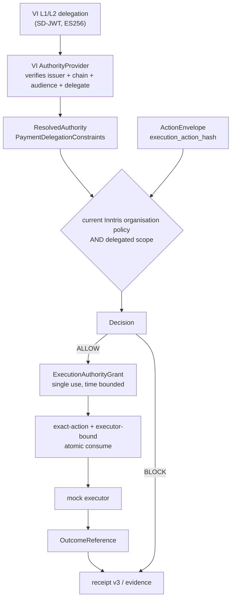

# Verifiable Intent as an authority input to Inntris policy

A deterministic, offline, reproducible demonstration of three separate
claims:

1. Inntris can verify and consume a real Verifiable Intent delegation
   format as an **authority input**.
2. A VI-valid action can still be **BLOCKED** by stricter current Inntris
   organisation policy.
3. An Inntris **ALLOW becomes bounded execution authority** tied to the
   exact action and executor, with safe retry and replay semantics.

## Architecture statement

Verifiable Intent answers *what did an issuer and a user delegate*.
Inntris answers *what does this organisation permit, right now, for this
principal, and who may execute it*. They are different questions, and the
second is not downstream of the first being satisfied — it is
independent, and it may refuse what the first plainly allows.

The effective permission is an intersection:

```
organisation policy  AND  delegated authority scope
```

A delegated scope can only narrow. It can never widen an organisation
limit, re-enable a blocked action, or authorise a destination the
organisation refuses.



See [architecture.md](architecture.md) for what is trusted at each stage
and why.

## Verifiable Intent build under test

| | |
|---|---|
| Repository | <https://github.com/agent-intent/verifiable-intent> |
| Commit | `356c29635f1c44df7de02edb58699ca9f29bece6` |
| Specification | Verifiable Intent v0.1-draft |
| Mode | Autonomous (3-layer: L1 issuer credential, L2 user mandate, L3a agent payment fulfilment) |

The delegation the proof verifies is signed in-process by that
implementation on every run. Nothing is replayed from a recorded string,
and no SD-JWT, ES256 or chain rule is reimplemented here.

The pin is checked rather than asserted: the commit actually installed is
read back from the distribution's `direct_url.json`, written into every
evidence file as `vi_upstream.installed_commit`, and the proof refuses to
run on a mismatch.

## Running it

```bash
pip install -e '.[dev,vi-proof]'
alembic upgrade head
python -m scripts.mastercard_vi_proof
```

Requires `DATABASE_URL` pointing at a PostgreSQL migrated to head — the
proof runs against the real authority persistence, not a simulation. It
makes no network call, prints the case table, writes one JSON evidence
file per case to `evidence/`, and exits non-zero if any assertion fails.

The same cases run in CI as `tests/test_mastercard_vi_proof.py`, with the
broader acceptance suite in `tests/test_mastercard_vi_acceptance.py`.

### What "deterministic" means here

The **outcomes** are deterministic: same cases, same decisions, same
reason codes, every run. The **bytes** are not, and must not be. ES256
signatures carry a random nonce and SD-JWT disclosures carry a random
salt — both by design, the second for privacy. Fixing them would mean
patching the reference implementation's cryptography, and a proof that
weakened the checks it demonstrates would prove nothing. Each evidence
file therefore records the artefact digest of the run that produced it.

## Proof fixture

One cryptographically valid autonomous VI delegation, permitting:

- **Supplier A** and **Supplier B** as payees;
- **USD up to 20,000.00**, as `mandate.payment.amount_range` — a
  per-transaction bound, not a cumulative budget.

The Inntris organisation policy is deliberately narrower:

| Rule | Value |
|---|---|
| Action type | `wallet_transaction` |
| Chain | `eip155:8453` |
| Allowlisted execution recipient | Supplier A's account only |
| Per-action limit | 10,000.00 USD |
| Daily limit | 100,000.00 USD |

Supplier B is permitted by VI and *not* allowlisted by Inntris. The
Inntris per-action cap is below VI's ceiling. Those two gaps are what
cases 2 and 3 exercise.

`wallet_transaction` was chosen because it is the existing payment action
whose evaluation already runs **both** the recipient allowlist and the
spend caps. No policy behaviour was changed to make the cases come out.

## The seven cases

| # | case | VI | Inntris policy | grant | consume |
|---|---|---|---|---|---|
| 1 | permitted + executed | PASS | ALLOW | issued | authorised |
| 2 | VI-valid, organisation recipient block | PASS | BLOCK `wallet_recipient_not_allowed` | none | — |
| 3 | VI-valid, organisation spend block | PASS | BLOCK `per_action_limit_exceeded` | none | — |
| 4 | tampered action after ALLOW | PASS | ALLOW | issued | `grant_action_mismatch`, then authorised |
| 5 | replay vs idempotent retry | PASS | ALLOW | issued | authorised, recovered, `execution_ref_conflict` |
| 6 | expiry | PASS | ALLOW | issued | `grant_expired` |
| 7 | wrong executor | PASS | ALLOW | issued | `grant_executor_mismatch`, then authorised |

44 assertions across the seven cases. Every row above comes from the
deterministic proof run; nothing in this document is estimated.

### Why cases 2 and 3 prove VI is an input, not Inntris's decision

Both cases refuse an action whose delegation is **entirely valid**. Each
evidence file records, in order:

1. `vi_verification.chain_valid: true` with the reference
   implementation's own list of checks performed — issuer signature,
   `l2_aud`, the L2 reference binding, the L3a audience and structural
   chain;
2. `resolved_authority.is_verified: true`, `delegate_binding_status:
   bound`, and the mapped scope showing Supplier B among `allowed_payees`
   and `max_amount: "20000.00"`;
3. `inntris_decision.decision: block` with the organisation's own reason
   code.

In case 2 the payee is one VI explicitly permits. In case 3 the amount is
18,000.00 against a VI ceiling of 20,000.00. Neither refusal can be a broken credential,
because the credential verified first and its supported constraints were
satisfied. The block is Inntris organisation policy, and nothing about
the delegation would change it.

Order matters and is structural, not incidental: the provider resolves
and verifies the delegation **before** any policy check runs. A refusal
therefore always carries a VI verdict established beforehand.

### Why cases 4, 5, 6 and 7 demonstrate execution authority, not a policy API

A policy API answers "may this class of thing happen". Each of these four
cases presents an action a policy API would have to approve, and each is
refused anyway — because the ALLOW produced authority bound to one exact
act, one executor, and one window.

- **Case 4 — bound to the act.** The grant is for 8,500.00. The executor
  presents 9,500.00, which is under the 10,000.00 cap and inside VI's
  range, so policy would independently permit it. It is refused
  `grant_action_mismatch`. The failed attempt does **not** burn the
  grant, and the original 8,500.00 then consumes.
- **Case 5 — one execution, recoverable.** The same `execution_ref`
  returns the original consumption evidence and does not invoke the
  executor a second time. A *different* `execution_ref` on the same
  spent authority is refused. Same reference is idempotent success;
  different reference is replay failure. These are not the same event.
- **Case 6 — bound in time.** The exact action, by the exact bound
  executor, holding an authentic token, is refused `grant_expired` once
  the window closes. Advanced with an injected clock; nothing sleeps.
- **Case 7 — bound to the executor.** Executor B — same organisation,
  same scopes, the same caller-supplied `executor_reference` — is refused
  `grant_executor_mismatch`. The binding derives from the authenticated
  API key, so copying a reference gains nothing. The refusal does not
  burn the grant, and Executor A still consumes it.

## Inntris verdict and reason vocabulary

These are the live deployed codes, identical in value to the existing
`api.policy.PolicyViolation` vocabulary. None was invented for this
proof — in particular it is **not** `recipient_not_allowed` or
`spend_limit_exceeded`.

Verdicts: `allow`, `block`, `require_approval`. A `require_approval`
decision yields no grant.

| Code | Meaning in this proof |
|---|---|
| `wallet_recipient_not_allowed` | The execution recipient is not in the organisation's allowlist for that chain (case 2) |
| `per_action_limit_exceeded` | The amount is above the organisation's per-action cap (case 3) |
| `wallet_chain_not_allowed` | The chain is not in the organisation's allowlist |
| `daily_limit_exceeded` | The organisation's cumulative daily cap |
| `agent_not_active` | The principal was suspended between evaluation and consume |
| `policy_hash_mismatch` | Organisation policy changed between evaluation and consume |
| `grant_action_mismatch` | The presented act is not the act the grant authorises (case 4) |
| `grant_executor_mismatch` | The caller is not the executor the grant is bound to (case 7) |
| `grant_expired` | The grant's validity window closed (case 6) |
| `grant_already_consumed` | Single-use authority already spent |
| `execution_ref_conflict` | A different execution reference attempting to reuse spent authority (case 5) |
| `authority_required_but_missing` | The organisation requires delegated authority and none was presented |
| `authority_scope_exceeded` | The act falls outside the delegated scope |
| `authority_scope_unsupported` | The delegation carries a constraint this build cannot enforce |
| `authority_revoked` / `authority_expired` / `authority_unverified` | The delegation was withdrawn, lapsed, or had no current evidence at consume time |

Consumption outcomes: `authorised` (the one attempt that spent the
grant), `recovered` (an idempotent retry — authorises nothing), and
`rejected`.

On case 5's replay: `execution_ref_conflict` is reported rather than
`grant_already_consumed` because it is the more specific of the two codes
the refusal qualifies for, and it outranks the other in
`CONSUMPTION_REJECTION_PRECEDENCE`. The caller's reference, not the
grant, is what does not match.

## Supported VI constraint types

Mapped onto enforceable scope and intersected with organisation policy:

- `mandate.payment.amount_range` → per-transaction `max_amount` and
  `currency`.
- `mandate.payment.allowed_payees` → `allowed_payees`. A payee identity
  is **not** a destination: it is bound to a concrete network, account
  and asset by trusted server-side state, and an unbound payee fails
  closed.

Checked by the chain verification that necessarily passed first, and
carrying no payment-scope semantics of its own:

- `mandate.payment.reference`.

Everything else fails closed with `authority_scope_unsupported` —
`mandate.payment.budget`, `mandate.payment.recurrence`,
`mandate.payment.agent_recurrence`, any constraint type published after
this build, and the `min` floor of an amount range. Enforcing the subset
this build understands would be **broader** authority than the issuer
granted, which is the one direction a partial reading must never go.

## What the evidence proves

For each case, independently inspectable without any test private key:

- the pinned upstream commit, and the commit actually installed;
- the issuer's public key, the delegate's public JWK, the credential
  subject, and digests of the L1 and L2 artefacts;
- the reference implementation's verification result, including the
  checks it performed and skipped;
- the mapped delegated scope;
- the ActionEnvelope's public fields, `signed_action_hash` and
  `execution_action_hash`;
- the Inntris decision, its exact reason codes, the `policy_hash` and
  policy snapshot format;
- the authority artefact digest and scope digest;
- the grant's public fields, the executor binding digest, the
  `execution_ref`, and the consumption result;
- the signed receipt v3 evidence chain and the public key that verifies
  it.

The serialised SD-JWTs are deliberately **not** published. They are a
bearer presentation; their digests are recorded instead.

## What the evidence does NOT prove

- **No Mastercard partnership, endorsement, certification or production
  conformance.** This is an independent test against a public open-source
  reference implementation. The `https://www.mastercard.com` issuer
  string is the identifier used in that implementation's own examples.
- **No Mastercard Agent Pay or AP4M integration.** Neither is contacted,
  implemented or simulated.
- **No payment settlement, and no cryptographic proof of downstream
  non-execution.** A receipt here proves authorisation and consumption
  evidence to the limits actually implemented. It is not proof that money
  moved, or that it did not.
- **No production issuer-key discovery.** There is no JWKS fetch, no
  `/.well-known` lookup and no key-rotation protocol. Trusted issuer keys
  come from explicit server-side configuration.
- **No production executor enforcement or settlement.** The mock executor
  and its SQLite execution journal are proof components. Nothing in
  `api/` imports them and they settle nothing.
- **No support for VI constraint types outside the supported set above.**
  Anything else fails closed rather than being partially enforced.
- **No claim about VI Immediate mode**, multi-pair mandates, or the
  checkout side of the chain. Only the autonomous payment path is
  exercised.
