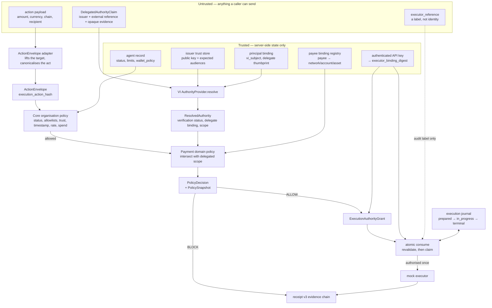

# The authority pipeline, and what is trusted at each stage

Companion to [README.md](README.md). The same pipeline, annotated with
where trust comes from — because at every stage the interesting question
is not *what* is computed but *who was allowed to say it*.

## Stage by stage

**1. Resolution.** The claim names an issuer and carries serialised
SD-JWTs. The provider takes the signing key from the trust store, never
from the artefact — the alternative verifies the chain against whatever
key the presenter chose, which is not verification. It then checks three
things a chain check alone does not: the mandate's audience is this
deployment, the delegated agent key is the one this organisation
registered for this principal, and the credential subject is this
principal's. All three answers come from server-side state.

Every routine denial returns an unverified `ResolvedAuthority` with typed
issues. A provider that raised on denial would turn an expected BLOCK
into a 500.

**2. The act.** The payload is canonicalised into an `ActionEnvelope`
with one `execution_action_hash`. This is the semantic digest of the act,
and it is recomputed server-side at consumption from what was actually
presented — never taken from the request.

**3. Organisation policy decides first, and alone.** Agent status,
allowed and blocked actions, action-type registration, policy binding,
trust threshold, timestamp skew, rate limits, the wallet chain and
recipient allowlists, and the spend caps. This is the same evaluation
legacy `/verify` runs; the new surface cannot be the weaker path.

**4. The delegated scope narrows, and only narrows.** It runs *after*
organisation policy has already allowed the act. It can refuse more; it
can never permit what step 3 refused. An approved payee is bound to a
concrete network, account and asset before it counts — a payee identity
is not proof that an account belongs to that payee. A scope carrying a
constraint this build cannot enforce fails closed rather than being
partially applied.

**5. ALLOW becomes a grant.** Single use, time bounded, and bound to the
`execution_action_hash` and to an `executor_binding_digest` derived from
the authenticated API key. The caller-supplied `executor_reference` is
carried for audit and trusted for nothing.

**6. Consumption is where current reality wins.** The evaluation-time
policy snapshot is evidence of what was evaluated, not a licence to skip
re-validation. Inside one transaction the store re-reads the principal
and the policy, requires current evidence about the delegation, and only
then claims the grant. Identity and integrity are checked before
lifecycle, so a caller holding the wrong authority is told that rather
than "expired".

**7. Recovery is not authorisation.** A retry under the same
`execution_ref` returns the original committed consumption. It spends
nothing, and it is not an instruction to call the executor again. The
journal is what makes that enforceable rather than merely intended: the
side effect runs only for the caller that wins an atomic claim, and the
claim can be won once.

## The two orderings that carry the argument

*Resolution precedes policy.* A BLOCK is therefore always accompanied by
a VI verdict established beforehand, which is what makes "VI-valid,
refused by Inntris" a demonstrable state rather than an assertion.

*Policy decides before scope narrows.* A delegation can only ever subtract
from what the organisation already permits, so no credential — however
generous, however well signed — can widen an organisation's own limits.
