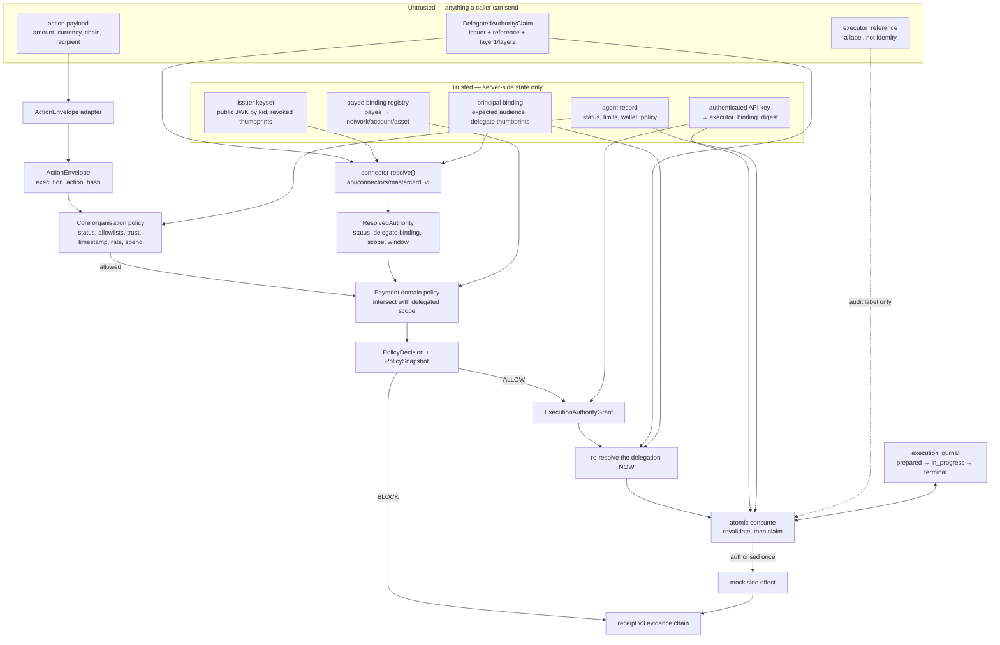

# The authority pipeline, and what is trusted at each stage

Companion to [README.md](README.md). The same pipeline, annotated with
where trust comes from — because at every stage the interesting question
is not *what* is computed but *who was allowed to say it*.

## Stage by stage

**1. Resolution.** The claim names an issuer and carries the Layer 1 and
Layer 2 serialisations. The connector takes the signing key from the
trusted keyset by `kid` — a locator, never identity, with revocation
expressed on the key's thumbprint — and never from the artefact. The
alternative verifies the chain against whatever key the presenter chose,
which is not verification. `skip_issuer_verification` is not reachable
from here at all.

It then checks what a chain check alone does not: that the mandate's
audience is this deployment, that the delegated agent key is one this
principal is bound to and not one revoked for it, and that the claim's
external reference is this credential's own mandate-pair reference. All
of those answers come from server-side state.

Layer 3 is refused rather than ignored. Every routine denial returns an
unverified `ResolvedAuthority` with typed issues; a provider that raised
on denial would turn an expected BLOCK into a 500.

**2. The delegation's window.** `max(L1.iat, L2.iat)` to
`min(L1.exp, L2.exp)` — the intersection, because a delegation exists
only while every credential it rests on is current. No clock skew is
applied: skew is a tolerance for *reading* a timestamp, and adding it
here would extend real authority past the moment the issuer said it ends.

**3. The act.** The payload is canonicalised into an `ActionEnvelope`
with one `execution_action_hash`, recomputed server-side at consumption
from what was actually presented and never taken from the request.

**4. Organisation policy decides first, and alone.** Agent status,
allowed and blocked actions, action-type registration, policy binding,
trust threshold, timestamp skew, rate limits, the wallet chain and
recipient allowlists, and the spend caps. The same evaluation legacy
`/verify` runs; the new surface cannot be the weaker path.

**5. The delegated scope narrows, and only narrows.** It runs *after*
organisation policy has already allowed the act. An approved payee is
bound to a concrete network, account and asset before it counts — a payee
identity is not proof that an account belongs to that payee. A scope
carrying a constraint this build cannot enforce fails closed rather than
being partially applied.

**6. ALLOW becomes a grant.** Single use, time bounded, never outliving
the delegation it rests on, and bound to the `execution_action_hash` and
to an `executor_binding_digest` derived from the authenticated API key.
The caller-supplied `executor_reference` is carried for audit and trusted
for nothing.

**7. Re-resolution, then consumption.** Issuance-time verification is not
standing authority. Before the claim, the caller re-resolves the
delegation through the connector and hands the store current evidence;
inside one transaction the store re-reads the principal and the policy,
requires that evidence to be about *this* authority, and only then claims
the grant. A grant issued under a delegated scope cannot be consumed with
no evidence at all — that is `AUTHORITY_UNVERIFIED`, and the proof never
bypasses it. Identity and integrity are checked before lifecycle, so a
caller holding the wrong authority is told that rather than "expired".

**8. Recovery is not authorisation.** A retry under the same
`execution_ref` returns the original committed consumption. It spends
nothing and is not an instruction to call the executor again. The journal
makes that enforceable rather than merely intended: the side effect runs
only for the caller that wins an atomic claim, and the claim can be won
once.

## The three orderings that carry the argument

*Resolution precedes policy.* A BLOCK is therefore always accompanied by
a VI verdict established beforehand, which is what makes "VI-valid,
refused by Inntris" a demonstrable state rather than an assertion.

*Policy decides before scope narrows.* A delegation can only subtract
from what the organisation already permits, so no credential — however
generous, however well signed — can widen an organisation's own limits.

*Re-resolution precedes consumption.* What was true when the decision was
made does not authorise anything now. A delegation revoked in between
fails at the moment it matters.
